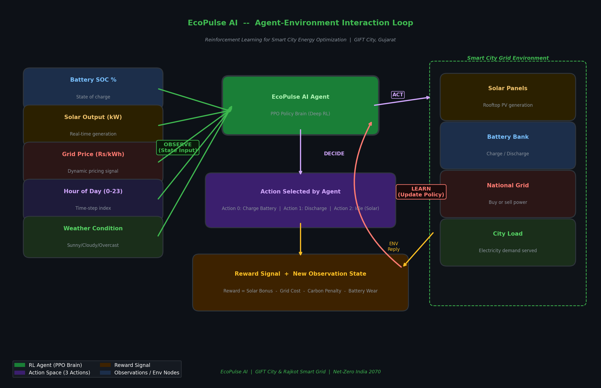
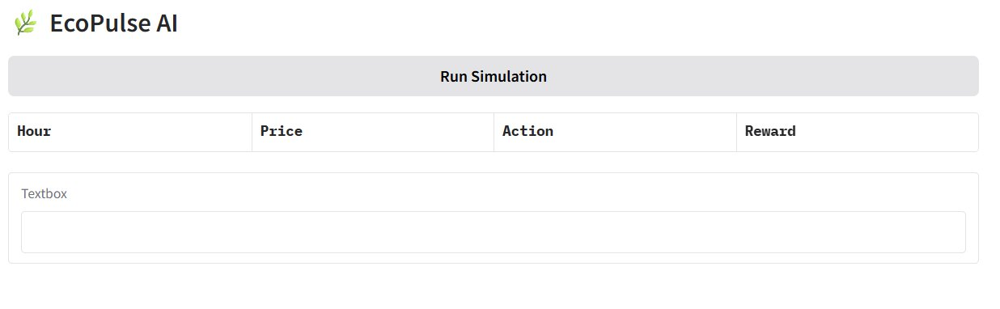

[README (1).md](https://github.com/user-attachments/files/26347641/README.1.md)
<div align="center">

```
   🌿〰〰〰〰〰〰〰〰〰⚡〰〰〰〰〰〰〰〰〰🌿
         E C O P U L S E   A I
   〰〰〰〰〰〰〰〰〰〰〰〰〰〰〰〰〰〰〰〰〰〰
```

# ⚡ EcoPulse AI

### *The Digital Heartbeat of a Smart City's Energy Ecosystem*

> **"It doesn't just flip switches — it thinks, predicts, and acts.  
> Managing solar intake and battery storage based on real-time grid economics  
> for a sustainable, Net-Zero future."**

---

[](https://python.org)
[](https://stable-baselines3.readthedocs.io/)
[](https://gymnasium.farama.org/)
[](https://huggingface.co/spaces/Sakshiba008/EcoPulse-Smart-Grid)
[](https://github.com/jmeetrajsinh845-commits/EcoPulse-AI)
[](LICENSE)
[]()

</div>

---

## 🌍 The Problem: Cities Are Bleeding Energy

Modern cities like **GIFT City (Gujarat International Finance Tec-City)** and **Rajkot** are growing at an unprecedented pace. But this growth comes with a hidden cost — a broken, inefficient energy system:

| Challenge | Real-World Impact |
|-----------|-------------------|
| 🔴 **Peak-Hour Price Spikes** | Electricity rates surge 3–5× during 6–10 PM, inflating costs for businesses and residents |
| 🔴 **Solar Wastage** | Excess solar energy generated at noon gets dumped because storage isn't managed intelligently |
| 🔴 **National Grid Overdependence** | Cities draw from the national grid even when cheaper, cleaner alternatives are available |
| 🔴 **Reactive Management** | Human operators make decisions *after* demand spikes — too slow, too costly |
| 🔴 **Zero Carbon Accountability** | Traditional energy systems have no mechanism to track or optimize toward Net-Zero targets |

> **The result?** Millions of rupees wasted annually. Carbon emissions that don't need to exist.  
> A grid that struggles daily. And a Net-Zero 2070 goal that feels impossibly far away.

---

## 💡 The Solution: EcoPulse AI — A Predictive Reinforcement Learning Agent

EcoPulse AI is a **Deep Reinforcement Learning agent** trained on a custom smart-city energy environment. It learns, adapts, and continuously improves its strategy to solve the energy puzzle — autonomously.

### 🧠 The Core Intelligence Loop

```
┌─────────────────────────────────────────────────────────────────┐
│                    EcoPulse AI Decision Engine                  │
│                                                                 │
│   OBSERVE → PREDICT → DECIDE → ACT → LEARN → REPEAT            │
└─────────────────────────────────────────────────────────────────┘
```

### ⚡ What the Agent Does (24 Hours / 96 Decision Steps)

```
🌅 Morning (6 AM – 12 PM)   │ Solar ramp-up detected → Begin charging battery bank
                             │ Grid price = LOW → Buy extra units from grid if needed
                             │
☀️  Noon (12 PM – 3 PM)     │ Peak solar generation → Prioritize solar for all loads
                             │ Surplus solar → Charge battery to 100%
                             │ Grid interaction = MINIMAL
                             │
🌆 Evening (4 PM – 10 PM)   │ Grid price = HIGH (PEAK ZONE) → STOP buying from grid
                             │ Discharge battery to serve load
                             │ Solar = declining → Smart handoff to battery
                             │
🌙 Night (10 PM – 6 AM)     │ Grid price = LOW → Buy just enough for next day's base
                             │ Battery = conserved for next morning
```

**Key Behaviors Learned by the Agent:**

- ✅ **Buy from the grid during low-price hours** (e.g., 1–4 AM when rates are minimal)
- ✅ **Discharge battery during peak-price hours** (replace expensive grid electricity)
- ✅ **Maximize solar self-consumption** before drawing from storage or grid
- ✅ **Avoid battery over-cycling** to preserve long-term battery health
- ✅ **Predict cloud cover** to pre-emptively adjust storage levels

---

## 🚀 Why EcoPulse AI Is Different

### 1. 🏷️ Dynamic Pricing Intelligence
Unlike rule-based systems, EcoPulse AI **reads the price signal in real time**. It knows the difference between a ₹4/kWh off-peak rate and a ₹12/kWh peak rate — and acts accordingly.

### 2. ☁️ Weather-Aware Solar Prediction
The agent's observation space includes a **weather condition flag** (`Sunny / Partly Cloudy / Overcast`). This gives it the foresight to:
- Pre-charge the battery *before* a cloudy afternoon arrives
- Hold battery reserves when clear skies guarantee solar generation

### 3. 🏙️ Built for GIFT City & Rajkot's Reality
- Calibrated against **Indian grid pricing schedules** (DISCOM peak/off-peak structures)
- Designed for **hybrid rooftop solar + commercial battery** setups common in Gujarat's smart city projects
- Scalable to **multi-zone city-block** deployments

### 4. 📈 Learns and Improves Continuously
This is not a hardcoded controller. The agent is trained with **Proximal Policy Optimization (PPO)** and improves its policy over thousands of simulated episodes — getting smarter every cycle.

### 5. 🌱 Net-Zero Aligned Reward Function
The reward function is designed to **penalize grid carbon** and **reward solar usage**, directly aligning the agent's objective with sustainability targets:

```python
reward = (
    + solar_energy_used * SOLAR_REWARD_WEIGHT       # Reward green usage
    - grid_energy_bought * grid_price               # Penalize costly grid draw
    - carbon_emission_factor * grid_energy_bought   # Carbon penalty
    - battery_wear_cost                             # Battery health preservation
)
```

---

## 🔄 Visual Workflow: Agent–Environment Interaction Loop

The diagram below shows the full Reinforcement Learning loop powering EcoPulse AI — from raw observations to intelligent action to reward-driven learning.



> **How to read this diagram:**  
> The Agent observes 5 inputs (Battery SOC, Solar Output, Grid Price, Hour, Weather), selects one of 3 actions (Charge / Discharge / Idle), interacts with the Smart City Grid Environment, and receives a Reward signal. It then updates its policy (LEARN) and the loop repeats — 96 times per simulated day.

---

## 🖥️ Live Demo: EcoPulse AI on Hugging Face Spaces

Try the live simulation — click **Run Simulation** and watch the agent's real-time decisions logged in the `Hour | Price | Action | Reward` table:



> 🚀 **[Launch Live Demo → HuggingFace Spaces](https://huggingface.co/spaces/Sakshiba008/EcoPulse-Smart-Grid)**

The app allows you to:
- Press **Run Simulation** to trigger a full 24-hour episode
- Watch the agent log each timestep: price signal seen, action chosen, and reward earned
- Observe how the agent avoids expensive peak-hour grid purchases and maximizes solar/battery usage

---

## 🏗️ Technical Stack

```
┌──────────────────────────────────────────────────────────────┐
│                      EcoPulse AI Stack                       │
├────────────────────┬─────────────────────────────────────────┤
│ RL Framework       │ Stable-Baselines3 (PPO Algorithm)       │
│ Environment        │ Custom OpenAI Gymnasium Env             │
│ Simulation         │ 24-Hour / 96 Time-Step Energy Model     │
│ Observation Space  │ Battery SOC, Solar Output, Grid Price,  │
│                    │ Hour of Day, Weather Condition Flag      │
│ Action Space       │ Discrete (3): Charge / Discharge / Idle │
│ Training Platform  │ Google Colab / Local GPU                │
│ Deployment         │ Hugging Face Spaces (Gradio Interface)  │
│ Language           │ Python 3.10+                            │
│ Visualization      │ Matplotlib, Plotly                      │
│ Version Control    │ Git + GitHub                            │
└────────────────────┴─────────────────────────────────────────┘
```

### 📦 Core Dependencies

```bash
stable-baselines3>=2.0.0
gymnasium>=0.29.0
numpy>=1.24.0
pandas>=2.0.0
matplotlib>=3.7.0
plotly>=5.15.0
gradio>=4.0.0           # For HuggingFace Spaces deployment
torch>=2.0.0            # PyTorch backend for SB3
```

---

## ⚙️ How to Run

### 1. Clone the Repository
```bash
git clone https://github.com/jmeetrajsinh845-commits/EcoPulse-AI
cd EcoPulse-AI
```

### 2. Install Dependencies
```bash
pip install -r requirements.txt
```

### 3. Train the Agent
```bash
python train.py --timesteps 500000 --env SmartCityGrid-v1
```

### 4. Run a 24-Hour Test Simulation
```bash
python simulate.py --model models/ecopulse_ppo_final.zip --episodes 1
```

### 5. Launch the Gradio Dashboard (Local)
```bash
python app.py
```

---

## 📊 Results: 24-Hour Simulation Snapshot

> 🔬 *Results from a single 24-hour test episode (96 time steps)*

| Metric | Value |
|--------|-------|
| 🏆 **Total Episode Reward** | `[PLACEHOLDER — e.g., +1842.7]` |
| 💰 **Estimated Cost Saved vs. Baseline** | `[PLACEHOLDER — e.g., ₹2,340 / day]` |
| ☀️ **Solar Energy Utilized** | `[PLACEHOLDER — e.g., 87.3%]` |
| 🔋 **Battery Cycles Used** | `[PLACEHOLDER — e.g., 0.82 cycles]` |
| 🏭 **Peak-Hour Grid Draw** | `[PLACEHOLDER — e.g., Reduced by 64%]` |
| 🌿 **Carbon Offset (estimated)** | `[PLACEHOLDER — e.g., 18.4 kg CO₂]` |

> 📌 **[INSERT REWARD CURVE GRAPH HERE]**  
> *Suggested: Plot of cumulative reward vs. episode number during training. Save as `assets/training_reward_curve.png`*

> 📌 **[INSERT 24-HOUR ENERGY FLOW CHART HERE]**  
> *Suggested: Stacked area chart showing Solar / Battery / Grid contribution hour-by-hour. Save as `assets/24hr_energy_flow.png`*

---

## 🗺️ Future Roadmap: The Next 5 Years

```
2025 ━━━━━━━━━━━━━━━━━━━━━━━━━━━━━━━━━━━━━━━━━━━━━━━━━━━━ 2030
  │                                                          │
  ▼                                                          ▼
Phase 1          Phase 2          Phase 3          Phase 4
────────         ────────         ────────         ────────
✅ Core RL       🔄 EV Charging   📡 P2P Energy    🌐 Multi-City
   Agent            Integration     Trading          Federation
   (NOW)
                 Integrate EV     Neighbors sell   Deploy across
Single-zone      charging bays    surplus solar    GIFT City,
smart grid       as controllable  to each other    Rajkot,
simulation       loads. Agent     on a local       Surat,
                 decides when     blockchain       Gandhinagar
                 to charge EVs    microgrid        grid network
                 (off-peak only)
                                                   Phase 5
                                                   ─────────
                                                   🤖 Multi-Agent
                                                   Federated RL

                                                   Each city-block
                                                   has its own agent;
                                                   they coordinate
                                                   without sharing
                                                   private data
```

### Detailed Milestones

| Year | Feature | Impact |
|------|---------|--------|
| **2025** | Core RL Agent + GIFT City simulation | Proof of concept, cost benchmarks |
| **2025–26** | EV Fleet Charging Integration | Optimize 500+ EVs as controllable loads |
| **2026–27** | Peer-to-Peer Energy Trading Module | Residents earn from surplus solar |
| **2027–28** | Weather Forecasting API Integration | 48-hour predictive horizon |
| **2028–30** | Multi-Agent Federated RL Deployment | City-scale Net-Zero coordination |

---

## 🤝 Contributing

Contributions are welcome from energy engineers, ML researchers, and smart city enthusiasts!

```bash
# Fork the repo, then:
git checkout -b feature/your-feature-name
git commit -m "Add: your feature description"
git push origin feature/your-feature-name
# Open a Pull Request 🚀
```

Please read [CONTRIBUTING.md](CONTRIBUTING.md) before submitting.

---

## 🔗 Links & Resources

| Resource | Link |
|----------|------|
| 📁 **GitHub Repository** | [github.com/jmeetrajsinh845-commits/EcoPulse-AI](https://github.com/jmeetrajsinh845-commits/EcoPulse-AI) |
| 🤗 **Live Demo (HuggingFace Spaces)** | [Sakshiba008/EcoPulse-Smart-Grid](https://huggingface.co/spaces/Sakshiba008/EcoPulse-Smart-Grid) |


| 📧 **Contact / Collaboration** |jmeetrajsinh845@gmail.com , https://www.linkedin.com/in/sakshiba-jadeja-a3220b355/ |

---

## 📜 License

This project is licensed under the **MIT License** — see [LICENSE](LICENSE) for details.

---

<div align="center">

**Built with 💚 for a Net-Zero India**

*EcoPulse AI — Where Sustainability Meets Intelligence*

```
🌿 Solar  +  🔋 Storage  +  🤖 AI  =  🏙️ Smart City  →  🌍 Net-Zero
```

*"The best energy is the energy you never wasted."*

[](https://en.wikipedia.org/wiki/India)
[](https://giftgujarat.in/)
[](https://pib.gov.in/PressReleasePage.aspx?PRID=1763459)

</div>
